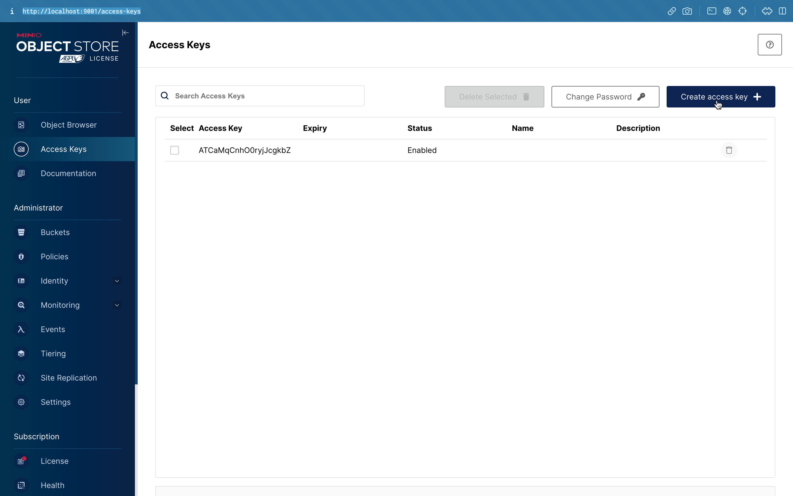

# グリル ( GU-RI-RU )

This web-based Point of Sale (POS) project is a term assignment assigned by
CPE334 - Software Engineering. In this project, I have developed a modern and
user-friendly web application designed to streamline and enhance the retail
sales process. With a focus on efficiency and ease of use, this POS system
provides essential features for businesses to manage inventory, process
transactions, and track sales data.

## 🚀 Getting Started

### ✔️ Prerequisites

Before you begin, ensure that you have the following prerequisites installed:

1.  node.js [18.18.0](https://nodejs.org/dist/v18.18.0/node-v18.18.0.pkg) or
    above
2.  [docker](https://www.docker.com/)

### 📦 Installation

Befor running any command. Open [docker](https://www.docker.com/) app first.

1. Clone the pos-se repository and copy .env.example:

```sh
git  clone  https://github.com/BlackBoxBanner/pos-se
cd  pos-se
cp .env.example ./.env.local
```

2. Install the dependencies:

```sh
npm install
```

3. Generate prisma type safe

```sh
npm run generate
```

4. Create docker instant

```sh
docker compose up -d
```

5. Add access key in Minio cloud storage

After running docker up `docker compose up -d` then enter
`http://localhost:9001` and create access key inside website.



#### Combine all command

```sh
git  clone  https://github.com/BlackBoxBanner/pos-se
cd  pos-se
cp .env.example ./.env.local
```

```sh
npm install
npm run generate
docker compose up
```

### Running Storybook

```sh
npm run storybook
```

### 🧪 Running Tests

```sh
npm run test
```

### Development

You can check out
[the Next.js GitHub repository](https://github.com/vercel/next.js/) - your
feedback and contributions are welcome!

## 👩‍💻 Coding Standard

Our coding standard follows
[standard react rules](https://github.com/pillarstudio/standards/blob/master/reactjs-guidelines.md#basic-rules)
and using [prettier](https://prettier.io/) to keep the code format clean.

---
